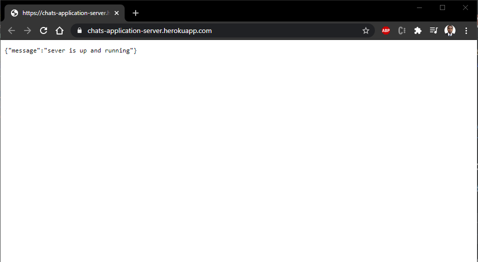
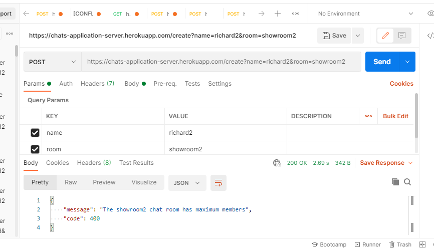
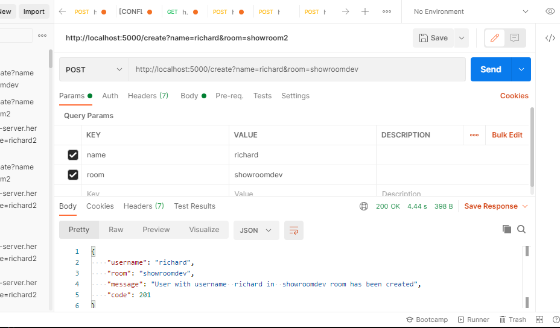
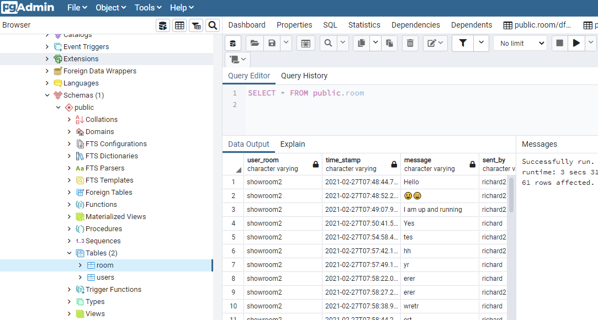
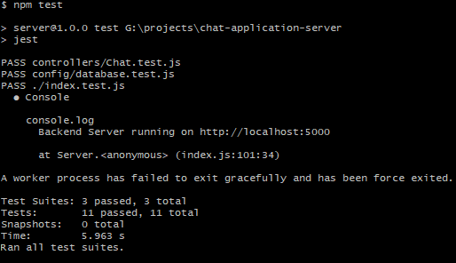

# Realtime Chat Application
Is a one-to-one real time chat web application .\
The application runs on https://chatrw-application.herokuapp.com/ remotely

### Access the Backend server remotely
The backend server is deployed to heroku servers at https://chats-application-server.herokuapp.com/ .\

Testing the endpoints through postman .\

### Running the backend server locally.
run npm start to start the backend server locally .\
The server is run locally at http://localhost:5000/ .\
Testing back-end locally through postman

### Database structure
The database runs on heroku servers as a back-end server resource plugin in the same environment
The postgres database consists of 2 tables; users and room tables
The users table stores user_name and the their associated chatroom.
The room table stores user_room, message and user_name or sent_by
Screenshoot of the database

### Tests.
run npm test to run the tests

